# ml

Forecasting on top of the pipeline in the repo root. Given what is known about a metro at a quarter, how much does its house price index move over the next one, two, four and eight quarters, and how sure can the model be.

Headline: scored only on what was published at each origin, a sequence GRU cuts the no-change error 41 percent at four quarters and 40 at eight on mean absolute error in percentage points, a gap a paired test over the 18 test origins puts beyond chance (p 0.02 at both), and runs bands 23 percent narrower at four quarters and 34 at eight than the metro's own long run average. Ridge regression's error is lower still at every horizon, but by gaps the same test cannot tell from chance, so the two are tied.

## The Input

| item | value |
|---|---|
| file | `../data/integrated/hpi_census_merged.csv` |
| rows x cols | 1,204 x 24 |
| metros | 410, of which 37 are metropolitan divisions |
| years | 2014, 2019, 2024 |
| sha256 | `b65d953f4c6beed7266be7da74292c45917d4c2fa404ba6414c402610dc18deb` |

Read only. This folder never writes to `data/`. If the pipeline re-runs, the hash in the loader is updated in the same commit.

## The Setup

```bash
cd ml
python3.12 -m venv .venv
.venv/bin/pip install -r requirements.txt
.venv/bin/pip install -e .
.venv/bin/python run_tests.py
```

Run the whole chain from the repo root:

```bash
ml/.venv/bin/python -m loop.panel
ml/.venv/bin/python -m loop.baselines
ml/.venv/bin/python -m loop.train
ml/.venv/bin/python -m loop.export
ml/.venv/bin/python -m bot.build_map_data
```

About four minutes on an M4. Every step leaves a figure in `results/figures/`.

## The Panel

One row per metro per quarter. 410 metros, 1975Q1 to 2026Q2, 71,072 rows. FHFA all-transactions gives the target. A value enters the panel when it was published. A monthly value is known in its own month. An annual value for year Y is known from the quarter of Y+1 its publisher releases it: population and migration from the first, permits from the second, income from the fourth, and BEA's late 2024 release from 2026Q1. Population growth across the Census's 2020 change of base and county lines is withheld, and so are permits counted over different counties than the people they are divided by. Divisions inherit what they lack from the parent metro. `results/panel_manifest.json` records row counts, the non-null share of every column and the parquet hash.

Three things the panel cannot undo. FHFA revises past quarters as later sales come in, so every origin reads the September 2026 vintage of the index rather than the one published at the time. Population and income are later vintages too: PEP's 2010 to 2019 figures come from its vintage 2019 and 2020 on from vintage 2025, and BEA's income is its current revision. And FHFA's expanded-data index existed for 50 metros before 2026, which The Models deals with.

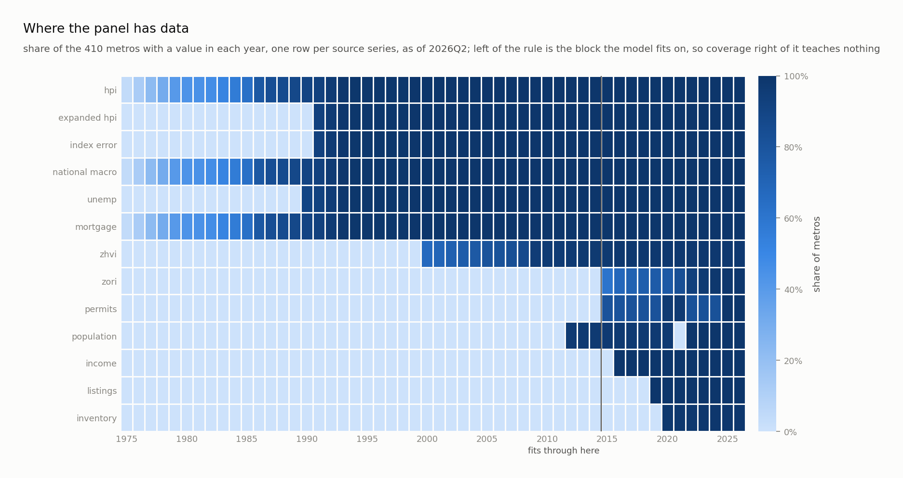

The figure is drawn from the full panel, so the expanded index and its error run full from 1991. The backtest reads them only for the 50 metros FHFA published before 2026, which the table below counts.

The rule in that figure is `spec.FIT_END`, and it is the only date that matters: the train block runs to 2017Q4 but its last three years are held out for validation, so a model fits on outcomes through 2014Q4. A column with no value left of the rule fails the `seen` test in `nets.moments`, and `encode` then zeroes both its value and its presence channel in every window, the test block included.

Eleven columns are features. Nine survive that test. Ten more ride along for the figures and the map without reaching a model, and why is in The Models.

| feature | share of fitting samples | share of test samples |
|---|---|---|
| price growth, mortgage rate | 1.00 | 1.00 |
| unemployment | 0.81 | 1.00 |
| expanded index and its error | 0.09 / 0.10 | 0.13 |
| Zillow home values | 0.37 | 0.98 |
| population and migration | 0.07 | 0.85 / 0.99 |
| permits, income | 0.00 | 0.85 / 1.00 |

The shares are the scored view, so the expanded index counts only the 50 metros FHFA published it for before 2026. The last row is the one to read, and it is why two different models are described below. Permits and income are in 85 and 100 percent of test samples and in none of the fitting ones, so the backtest scored in The Results reads nine series, while the forecast the map draws is refitted through 2026Q2 and reads all eleven. Deepening the two sources that could be deepened moved unemployment from 0.09 to above 0.8 and the mortgage rate from 0.50 to 1.00; these two have not been: both collectors start at 2014. `admit.py` measures them at a boundary where they are visible, and the result is in The Models.

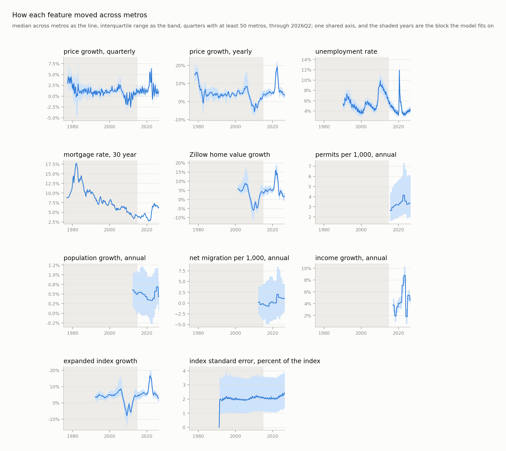


## The Evaluation Design

This is the part that makes the numbers mean anything.

The target is log growth of the index over h quarters. A sample is one metro, one origin quarter, one horizon. It lands in a block by where its outcome falls:

| block | outcome realized | used for |
|---|---|---|
| train | by 2017Q4 | fitting |
| calibration | 2018 to 2021 | band width, and the choice between the two networks |
| test | 2022Q1 or later | scored once |

The outcome quarter decides the block and nothing else does, so one origin sits in
different blocks at different horizons. Nothing realized after 2021 reaches a model
judged on 2022 onward.

An earlier version of `spec.block` read calibration and test off the origin instead.
That left 3,280 calibration samples at eight quarters where the rule gives 6,560, and
all of them landed in the 2020 to 2021 boom, so every published band width came off
two years of the least representative data in the panel. It also discarded every
sample whose outcome crossed a block edge. The blocks are horizon independent now,
6,560 calibration and about 7,375 test samples at each horizon.

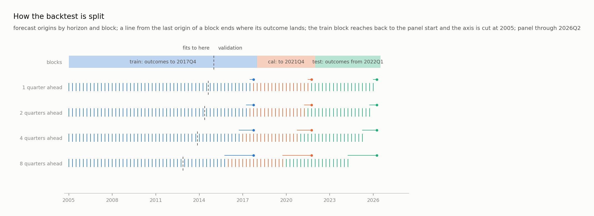

Bands come from conformalized quantile regression. The model predicts the 10th, 50th and 90th percentiles. The calibration block sets the smallest widening of that band covering at least 90 percent of held-out outcomes, with the finite sample correction of Romano, Patterson and Candes (2019).

That guarantee assumes exchangeable samples. Quarters are not exchangeable. So the test block coverage is the honest number, and it is reported beside every model.

## The Models

Five classical rules set the bar: no change, momentum, the metro's own average growth, ridge on price lags and covariates, and gradient boosting with quantile losses.

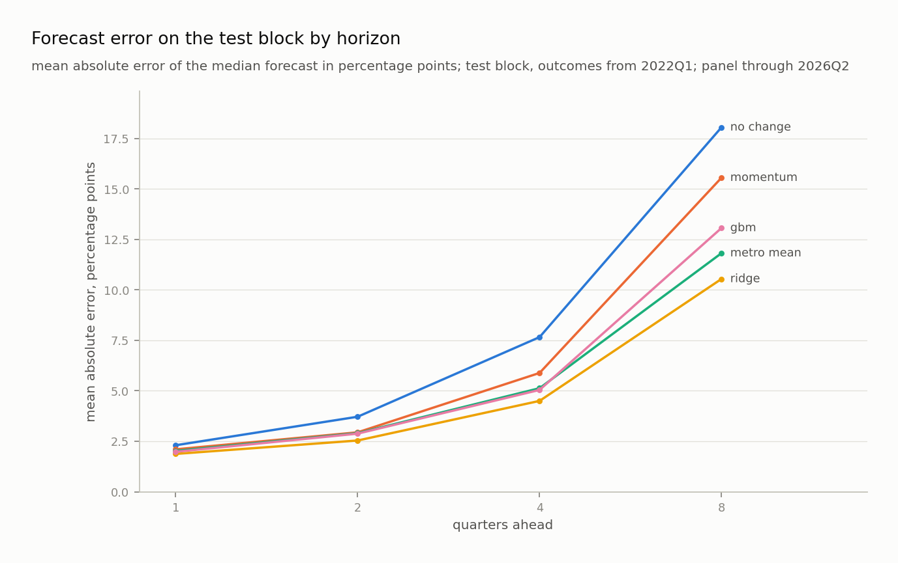
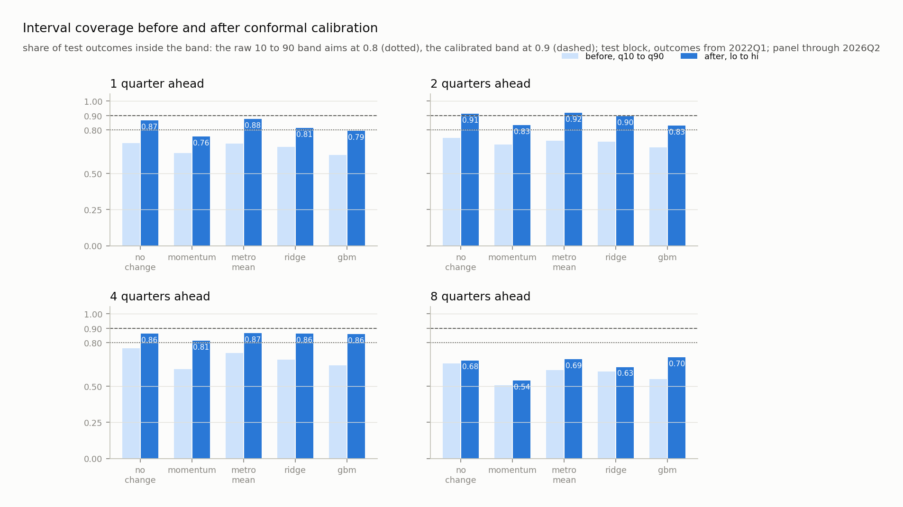
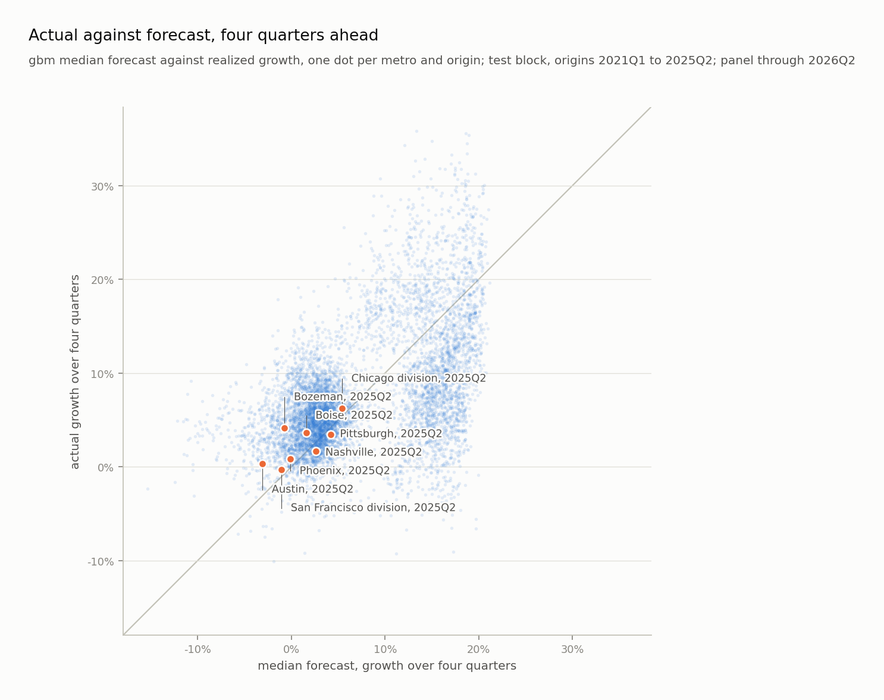

Two networks share one input: 24 quarters of seven series with a presence mask each, four annual features at the origin, and a learned embedding per metro. The window MLP flattens it into a three layer perceptron. The sequence GRU reads it as a sequence, then concatenates the final state with the annual features and the embedding. Both emit three monotone quantiles per horizon and train on pinball loss with Adam, weight decay and early stopping.

Learning rate, weight decay and the input set are chosen on validation loss, never on test. The validation set is the tail of the train block, outcomes realized 2015 to 2017. Permits and income, which the fitting block never sees, were admitted by a second run, `admit.py` below, that fits into the calibration block and scores the rest of it.

Two of those seven series come from a file FHFA publishes beside the index. `hpi_exp_metro.txt` carries the expanded-data index, a second FHFA estimate of the same metro quarter built from more records, and `rstderr`, FHFA's relative standard error for it in percent of the index. The error is the only published measure of how thin a metro's repeat-sale record is: at 2026Q2 Phoenix is measured to within 0.31 percent and Hinesville to within 10.6.

FHFA published the expanded index for 25 metros from 2012 and 50 from 2018, and reached all 410 only with its 2026Q1 report, once a 2023 upgrade of its county recorder data made the history possible. So the backtest reads it for those 50 alone, through `spec.realtime`, while the shipped forecast reads it for all 410 because FHFA publishes it now. Scored on FHFA's 2026 history for every metro, the two columns had cut the validation loss from 0.006567 to 0.006204, and 94 percent of that came from the 360 metros no forecaster could have read before 2026.

Candidate inputs, each fitted the same way and read on validation loss:

| input set | validation loss |
|---|---|
| seven series, the shipped set | 0.006555 |
| expanded index, no error | 0.006548 |
| five series, no expanded index | 0.006575 |
| plus the metro against the cross section median | 0.006568 |
| plus the calendar quarter as a sine and cosine | 0.006574 |
| plus CPI, the ten year, the term spread and national unemployment | 0.006631 |

Read only where it was published, the expanded index buys 0.000020 and its error buys nothing: the set without the error scores 0.006548. Every row is one seed, and five seeds of one arm in `admit.py` spread by up to 0.00027, so none of these margins is a result. The expanded index stays in the shipped set because a forecast made today can read it for every metro, and what it is worth in real time can only be measured as outcomes arrive. The four national series are worse than not having them by enough to read: one number shared by all 410 metros tells a window which era it sits in and nothing about the place, which is the same answer an earlier experiment on the metro running mean and the national mean gave. The rejected columns stay in the panel as `spec.CONTEXT`, out of reach of every model, because a negative result that is one command from being re-run is worth more than one written down.

`ablate.py` reproduces the table. It reads the validation block and nothing else.

That gate has a blind spot, and five columns fell into it. `nets.feature_stats` takes its `seen` mask from the fitting block and `nets.to_tensors` encodes every window with that mask, so a feature the fitting block never observes is zeroed in the validation block too, in both arms of any comparison. Rents, listing prices, inventory, permits and income were all in that state: declared as features, present in 85 to 100 percent of test samples, and reaching the network in none of them. They were never rejected here, they were never measured.

`admit.py` measures them by moving the boundary instead. It fits through 2019Q4, where four of the five are visible, and scores on the 13,120 outcomes realized in 2020 and 2021. The test block is never read, and a guard reads the label grid the model is handed and refuses the run if it ever is. Five seeds per arm, epochs re-picked inside each arm, and each seed moves both the starting weights and the order the batches come in. An earlier version moved only the weights, which made the spread of five seeds look about four times smaller than it is.

| input set | series | validation loss, mean of five | spread of the five |
|---|---|---|---|
| nine, what the old gate could see | 9 | 0.013452 | 0.000182 |
| plus rents and listing prices | 11 | 0.013341 | 0.000144 |
| plus permits and income | 11 | 0.013277 | 0.000267 |
| all four | 13 | 0.013250 | 0.000181 |

Seed for seed, every added pair beats the nine on all five seeds: permits and income by 0.000102 to 0.000319, rents and listing prices by 0.000060 to 0.000245. So both pairs help on this block. Permits and income help more on the mean, 0.000175 against 0.000111, but their ranges overlap, so which pair helps more is not settled. All four together beat the nine on every seed with no overlap at all, by 0.000202 on the mean. The shipped set is the nine plus permits and income, and the question that decides rents and listing prices is what they add to that set, not to the nine. Added to it, they gain 0.000027 on the mean and win on four seeds of five, a tenth of the spread five seeds of one arm produce, so they stay out. Inventory stays in `spec.CONTEXT`. Inventory is the one case nothing can settle: it starts 2020Q1, so any fitting window that sees it consumes the block that would score it, and it is dropped as unmeasurable rather than kept unmeasured.

Two cautions belong with that table. The scored block is the 2020 to 2021 boom, because it is the only window between the old fitting block and the test block. And permits and income enter the panel as annual values, which figure 03 shows as step functions.

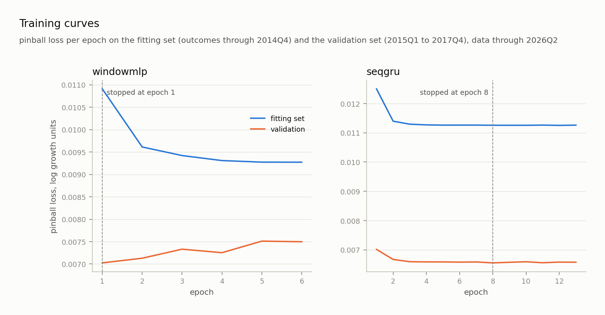
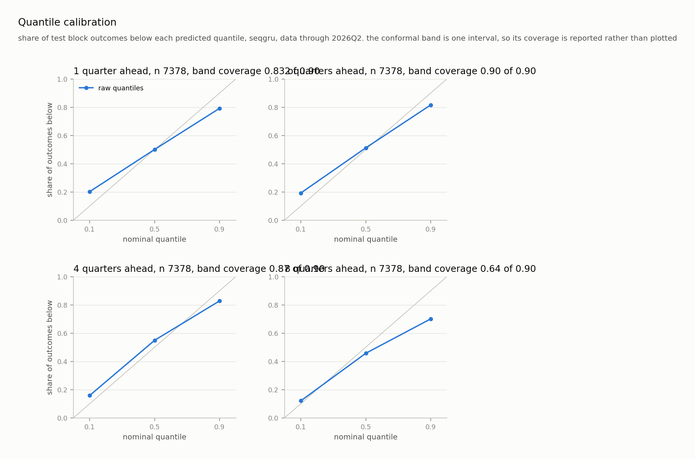

## The Results, 2022Q1 to 2026Q2

Mean absolute error of the median forecast, in percentage points of growth. Coverage is the share of outcomes inside the 90 percent band.

| model | 1q | 2q | 4q | 8q | coverage 1q/2q/4q/8q |
|---|---|---|---|---|---|
| no change | 2.30 | 3.72 | 7.66 | 18.05 | 0.87 / 0.91 / 0.86 / 0.68 |
| momentum | 2.10 | 2.94 | 5.89 | 15.56 | 0.76 / 0.83 / 0.81 / 0.54 |
| metro mean | 2.02 | 2.90 | 5.13 | 11.82 | 0.88 / 0.92 / 0.87 / 0.69 |
| ridge | 1.88 | 2.54 | 4.50 | 10.54 | 0.81 / 0.90 / 0.86 / 0.63 |
| gradient boosting | 1.98 | 2.88 | 5.05 | 13.07 | 0.79 / 0.83 / 0.86 / 0.70 |
| window mlp | 2.25 | 3.48 | 7.11 | 16.21 | 0.85 / 0.94 / 0.92 / 0.69 |
| sequence gru | 1.96 | 2.67 | 4.53 | 10.75 | 0.83 / 0.90 / 0.87 / 0.64 |

No change, momentum and the metro mean read no inputs, so their rows do not move when the inputs do. Ridge and gradient boosting read the eleven features at the origin plus eight quarterly price lags, the metro's running mean and a national growth mean, and fit on the whole train block through 2017Q4. The two networks read a 24 quarter window and fit through 2014Q4, holding 2015 to 2017 back to choose their epochs. So the classical rules learn from three more years than the networks, permits and income among them, and nothing on either side sees an outcome past 2017.

A lower mean error can be luck, so `backtest.paired_test` asks whether each gap between the GRU and another model is more than that, and `results/backtest/paired.csv` holds the answer. The 410 metros at one origin share its shocks and are not 410 independent draws, so the gap is averaged across metros at each of the 18 test origins first. That series gets a Diebold-Mariano test with a Newey-West variance of h - 1 lags, since origins h quarters apart share outcome quarters, and the Harvey, Leybourne and Newbold small sample correction. It separates the GRU from no change at four and eight quarters (p 0.017 and 0.018, 0.09 at one and two) and from the window MLP at one and two quarters (0.008 and 0.019). It separates nothing else: against ridge p runs 0.13 to 0.94, against the metro mean 0.48 to 0.56, and against momentum and gradient boosting no p is below 0.29. Eighteen origins that share one cycle are a short record, and most of the table's gaps are inside it.

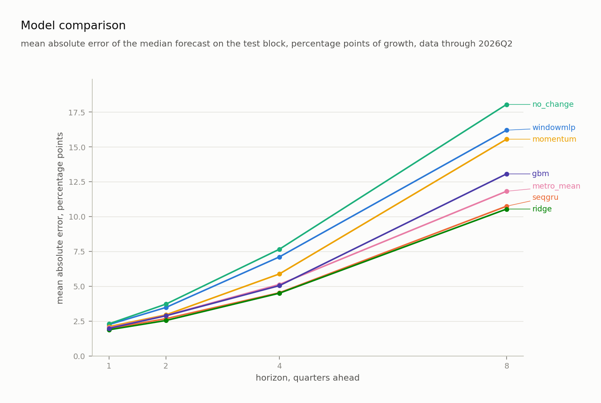

Three honest readings of that table.

- Ridge wins every horizon, by 0.08 points at one quarter, 0.13 at two, 0.03 at four and 0.21 at eight. The GRU used to lead at four and eight quarters, and holding the expanded index to its real publication did not change that: with that fix alone it still led by 0.12 and 0.11. The other two corrections moved the order. Withholding the 2020 population step cost the GRU 0.09 points at four quarters and 0.12 at eight and gained ridge 0.20 at eight, and reading income only once BEA published it gained ridge 0.05 at four quarters, so the early income had been hurting it. Held to what was published, a penalised linear model is the one to beat, and the GRU does not beat it. Ridge does not beat the GRU either by more than the paired test puts down to chance. The GRU's error is below the metro's own long run average at every horizon too, 4.53 against 5.13 at four quarters and 10.75 against 11.82 at eight, and no gap there passes the test either: a long mean is a good guess at a trend and a bad one across a boom, and eighteen origins of one cycle cannot tell the two apart.
- Ridge's band is narrower too, 0.170 against the GRU's 0.182 at four quarters and 0.198 against 0.213 at eight, at coverage within a point of the GRU's. So the GRU's case does not rest on its band either. It ships because the pipeline picks between the two networks on the calibration block, and ridge's lead is inside what the paired test puts down to chance.
- Gradient boosting falls to 13.07 at eight quarters, behind the metro mean. It swung half a point on one metro's Zillow history before, and a learner that moves that much on a few metros is not one to read a tenth of a point from.
- Every model under-covers at eight quarters, the GRU at 0.64 against a nominal 0.90, and the spread across models runs 0.54 to 0.70. That is the honest cost of a fixed calibration window, and it is read out in The Limits below rather than smoothed over.

The window MLP beats no change at every horizon but trails the metro's own long run average at every horizon. It is kept as the honest answer to what a plain perceptron does here.

## The Shipped Forecast

The GRU refitted on every outcome realized by 2026Q2, at the epoch count found above. Its band margin is out of sample: a second GRU fitted through 2021, calibrated on 2022 to 2026, and that margin applied to the final quantiles. The second GRU reads the expanded index only where FHFA had published it, so the margin comes from real time inputs and the shipped band is the conservative one.

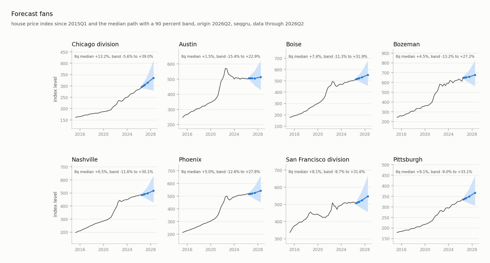
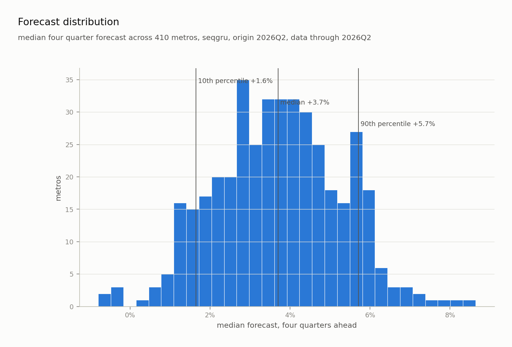

At the 2026Q2 origin the median four quarter forecast across 410 metros is 3.7 percent (10th to 90th percentile 1.6 to 5.7). Five metros are forecast to fall, the weakest at minus 0.8. The eight quarter median is 8.7 percent.

| where | metros | four quarter |
|---|---|---|
| highest | Elmira, Norwich-New London, Weirton-Steubenville, Muncie, Kenosha | 7.3 to 8.6 percent |
| lowest | Cape Coral, Punta Gorda, Sherman-Denison, Austin, North Port | minus 0.8 to minus 0.2 |
| Chicago division | | 6.1 percent, band -3.7 to 17.7 |

Every band is wide. That is the point of publishing one.

`export.py` writes the map's metrics contract to `results/forecast/metrics.csv`: expected growth at four and eight quarters with bands, realized growth over the last four, the five year annualized trend, the surprise, and the index standard error. The map shows them under Forecasts.

The index error is not a forecast and is credited to FHFA, not to the model. It rides in this file because nothing else on the map carries it, and it belongs beside a forecast because it says how firmly the thing being forecast is even measured. At 2026Q2 it runs from 0.31 percent in Phoenix and 0.34 in Denver, which are deep liquid markets, to 10.6 in Hinesville and 11.6 in Watertown-Fort Drum, which are small and thinly traded. A wide error there is a reason to read the forecast above it loosely.

## The Limits

- The calibration block is fixed at 2018 to 2021 by choice, and every model under-covers at eight quarters because of it, 0.54 to 0.70 against a nominal 0.90. Conformal coverage is guaranteed only for exchangeable samples. Calibration outcomes land in 2018 to 2021, which is the run up and the boom; test outcomes land in 2022 onward, which is the correction. The two regimes are not exchangeable and no margin fitted on the first covers the second. Rolling the calibration window forward would fix it by calibrating on the period being scored, which is leakage, so the number is reported rather than repaired. A wider held out period, or a conformal method built for distribution shift, is the real answer.
- Zillow home values reach 2000 and cover 0.38 of the fitting block, so they are thin where the model learns. Unemployment and the mortgage rate used to be in that list and are not any more, because their sources could be pulled back further.
- Rents, listing prices and inventory are in the panel and on the map but out of reach of every model, and keeping their monthly history would not change that. All three are 0.00 of the fitting block at any sampling rate, so the fix is a later fitting era, not a better collector, and a later fitting era buys fewer years to learn from. `admit.py` makes that trade once, on the 2020 to 2021 block: permits and income beat the set without them on every seed and ship, and rents and listing prices, added to that set, gain a tenth of the spread across seeds and stay out. Inventory starts 2020Q1 and cannot be measured at all without spending the block that would measure it.
- The band is very nearly one national width. At four quarters it runs 19.4 to 22.3 percentage points across all 410 metros, a standard deviation of 0.5 on a median of 20.6. That is the conformal step doing what it was built to do: `spec.apply_margin` adds one scalar per horizon to every metro alike, so all the per-metro variation has to come from the quantile heads, and they barely provide any. The model is now handed a published measurement error per metro, which is precisely the quantity that should widen a thin market's band and narrow a deep one's, and none of it reaches the band. A conformal method with a per-metro score, or a margin scaled by the index error, is the obvious next thing to try, and it has not been tried.
- A band that looks far too wide against one year is not too wide. The middle 90 percent of the misses at the 2025Q2 origin span about 9 points against a 19 point band, which invites the conclusion that the interval is doubled. It is not: the band has to cover where prices actually land, and across the whole test block the realized four quarter spread is 20.4 points against a median band of 19.4, which is why coverage is 0.87 and not 0.97. One origin's cross section is one draw of the cycle.
- The model separates metros less than it misses them. The cross metro standard deviation of the four quarter forecast is 1.6 points, well under the size of a typical miss. It does now forecast a fall, which it never did before the input set was cut to eleven: five metros are negative at the 2026Q2 origin, and they are Cape Coral, Punta Gorda, Sherman-Denison, Austin and North Port, which is a plausible list rather than a scattered one. Five out of 410 is still a model that mostly cannot say a particular metro is about to decline.
- The index standard error is FHFA's relative standard error, already a percent of the index, so the model and the map read the same number. An earlier version divided it by the index a second time for the map, which showed Denver at 0.05 percent where FHFA says 0.34.

## The Layout

```
src/loop/      package code. spec.py is the contract every module imports
tests/         unittest suite, run with run_tests.py
results/       manifests, backtest tables, forecasts, figures. tracked
data/ models/  built panel and trained artifacts. gitignored
MILESTONES.md  the build plan
```

## The Roadmap

| wave | adds | status |
|---|---|---|
| forecasting | quarterly panel, backtest, five baselines, two torch models, conformal bands, map export | done |
| 1 baseline | features, ridge/lasso, gradient boosting, residual analysis | in progress |
| 2 scenarios | conditional sampling, then a small VAE if it earns its place | planned |
| 3 dashboard | streamlit app, public link | planned |
